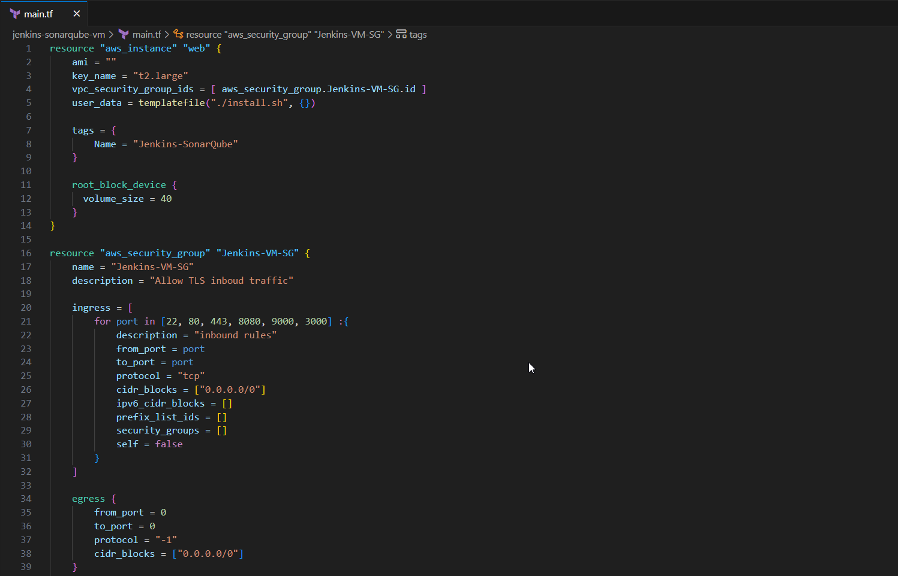

In this lab, you will act as a DevOps Engineer on the DevOps team for a marketing company. The organization is having trouble identifying problems with its products running on Kubernetes and it's costing them the trust of their clients. The DevOps chapter lead has proposed implementing Prometheus using Helm to monitor the pods in the cluster and Alertmanager to send notifications through Slack. You will be the engineer responsible for the entire implementation using Helm to simplify the Prometheus deployment and you will also have to configure basic alerts about the pod's CPU, RAM, memory, and uptime to catch errors before they occur.

### Objectives

- Install and upgrade Kubernetes applications using Helm
- Collect Kubernetes metrics with kube-state-metrics
- Send alerts to Slack using Alertmanager
- Deploy and Configure Prometheus in Kubernetes
- Create Prometheus alerts based on Kubernetes metrics


### Create EC2 Ubuntu instance

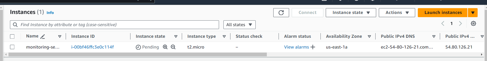


### To install the AWS CLI, run the following commands.

```
curl "https://awscli.amazonaws.com/awscli-exe-linux-x86_64.zip" -o "awscliv2.zip"
unzip awscliv2.zip
sudo ./aws/install
```
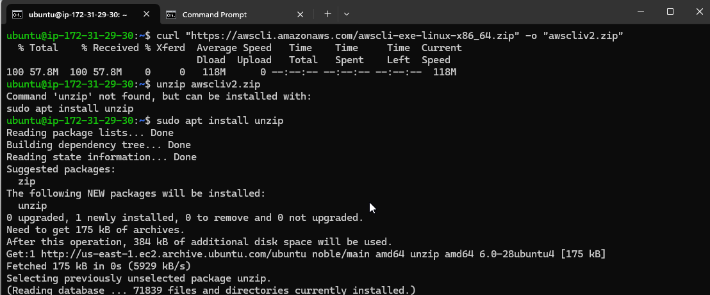

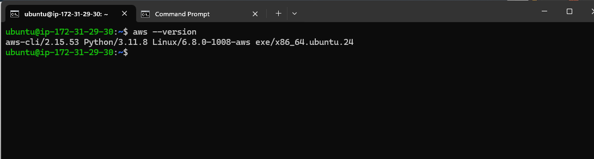


### Install and Setup kubectl on Ubuntu Server

```
sudo curl --silent --location -o /usr/local/bin/kubectl   https://s3.us-west-2.amazonaws.com/amazon-eks/1.22.6/2022-03-09/bin/linux/amd64/kubectl

sudo chmod +x /usr/local/bin/kubectl 

kubectl version --short --client
```
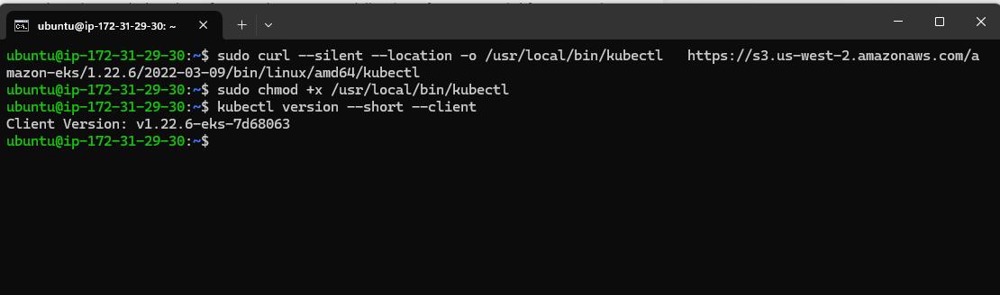

### Install and Setup eksctl on Ubuntu Server

```
curl --silent --location "https://github.com/weaveworks/eksctl/releases/latest/download/eksctl_$(uname -s)_amd64.tar.gz" | tar xz -C /tmp

sudo mv /tmp/eksctl /usr/local/bin
```

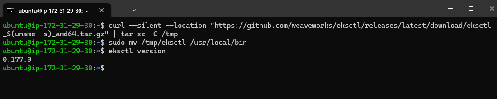

### Install Helm Chart

```
curl -fsSL -o get_helm.sh https://raw.githubusercontent.com/helm/helm/main/scripts/get-helm-3

chmod 700 get_helm.sh

./get_helm.sh
 DESIRED_VERSION=v3.8.2 bash get_helm.sh
 curl -L https://git.io/get_helm.sh | bash -s -- --version v3.8.2

```

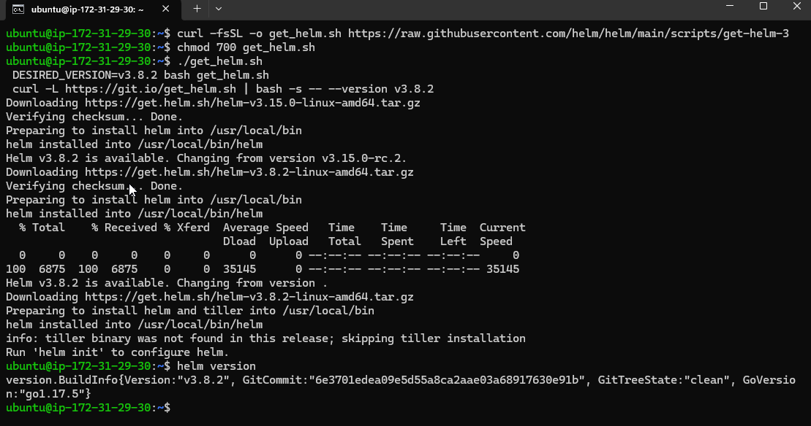

### Creating an Amazon EKS Cluster using eksctl

```
eksctl create cluster --name=eks-cluster --region=us-east-1 --version=1.29 --nodegroup-name=my-nodes --node-type=t3.medium --managed --nodes=2 --nodes-min=2 --nodes-max=3
```
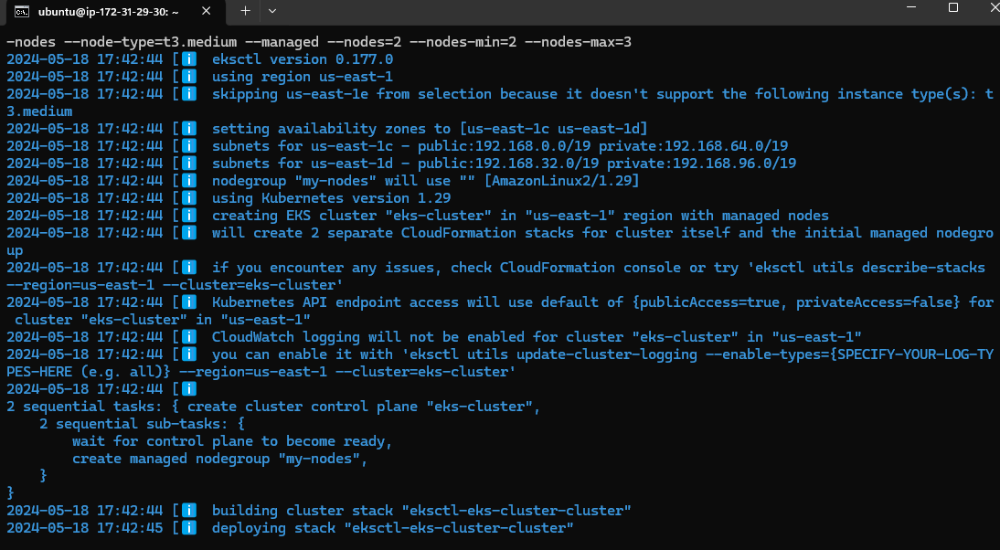

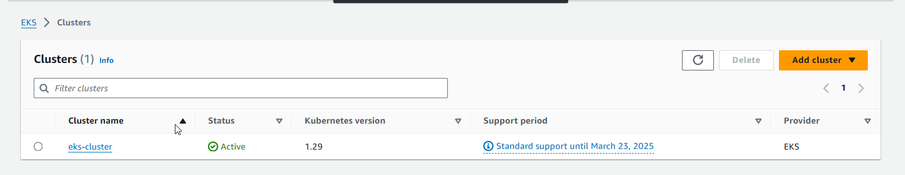

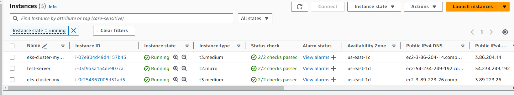

### Confirm that the cluster is running

```
eksctl get cluster --name eks-cluster --region us-east-1
```

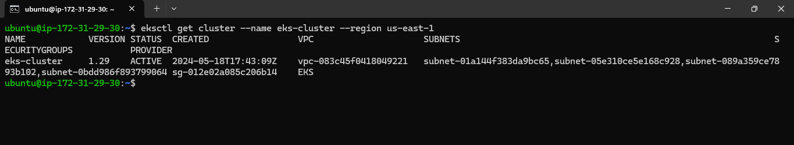

### Update Kube config

```
aws eks update-kubeconfig --name eks-cluster --region us-east-1
```
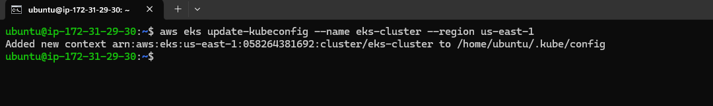

### Connect to EKS cluster and list of worker nodes as part of EKS cluster

```
kubectl get nodes

kubectl get ns

```
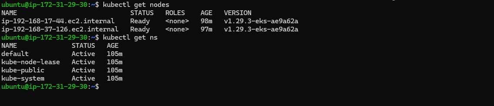

### Add Helm Charts for Your Local Client

```
helm repo add stable https://charts.helm.sh/stable
```
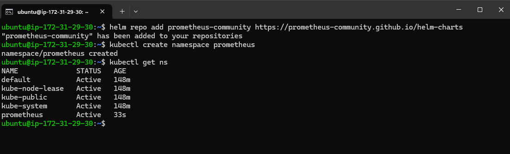

### Install Prometheus using Helm

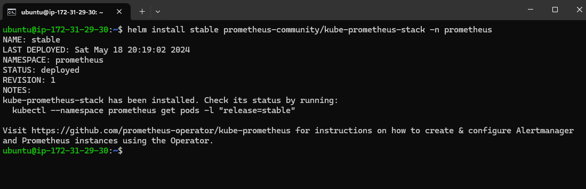

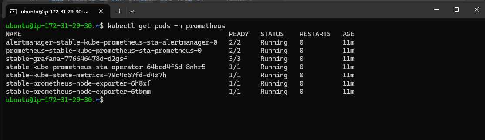

To verify if Prometheus has been successfully installed using Helm on the EC2 instance, you can execute the following command:

```
kubectl get pods -n prometheus
```

to check the services file (svc) of the Prometheus

```
kubectl get svc -n prometheus
```

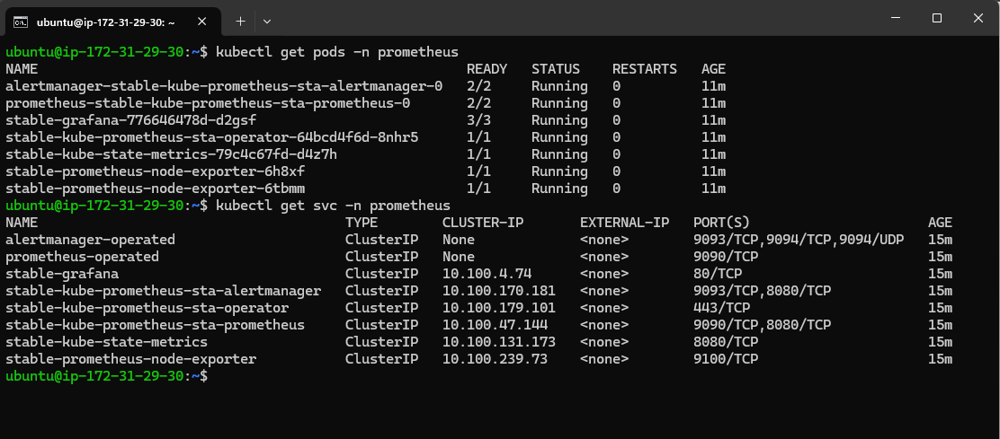

### Expose Prometheus and Grafana to the external world

Let’s expose Prometheus and Grafana to the external world
there are 2 ways to expose

1. through Node Port

2. through LoadBalancer

let’s go with the LoadBalancer
to attach the load balancer we need to change from ClusterIP to LoadBalancer
command to get the svc file.

```
kubectl edit svc stable-kube-prometheus-sta-prometheus -n prometheus
```

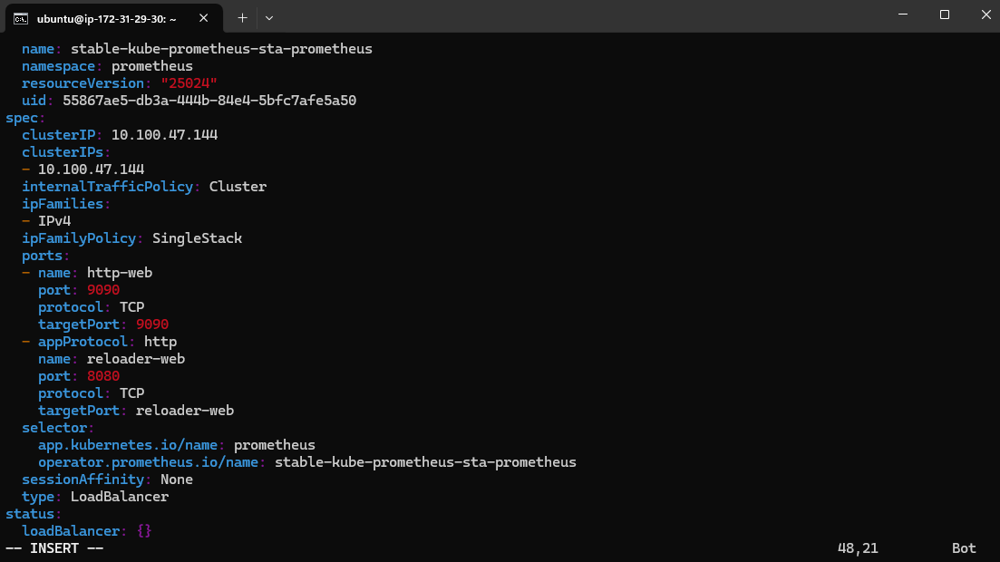

```
kubectl get svc -n prometheus
```

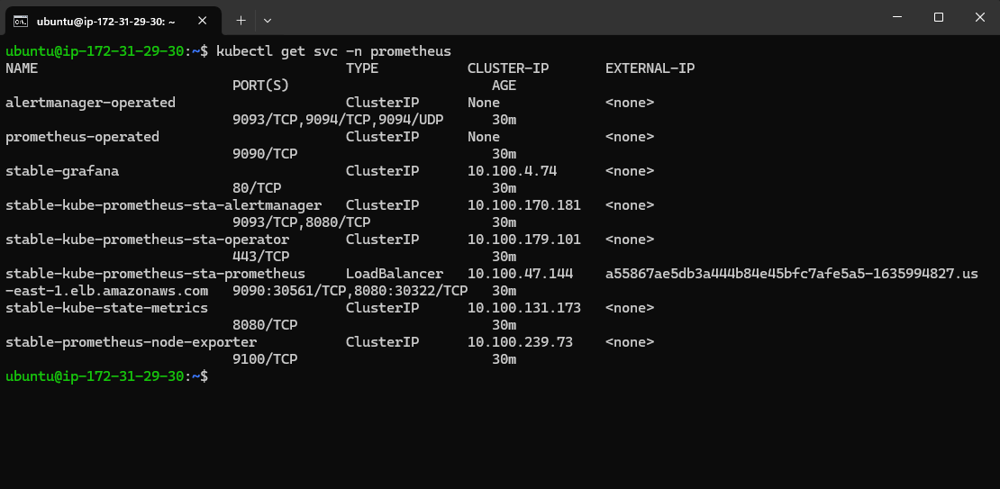

use the link of the LoadBalancer and access from the Browser

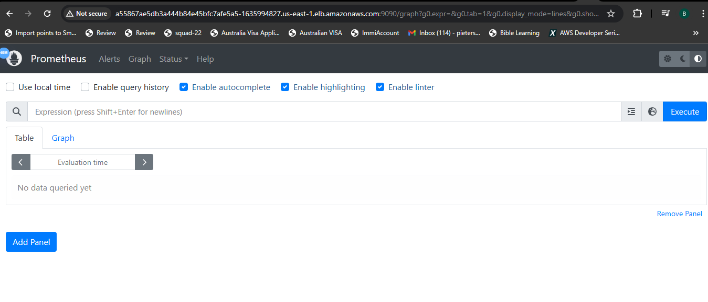

Get the password

```
kubectl get secret --namespace prometheus stable-grafana -o jsonpath="{.data.admin-password}" | base64 --decode ; echo
```

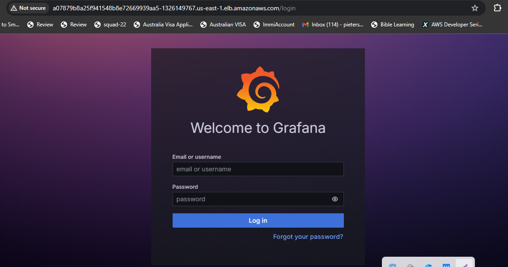

Add Data Source

Add Dashboard, import Dashboard


